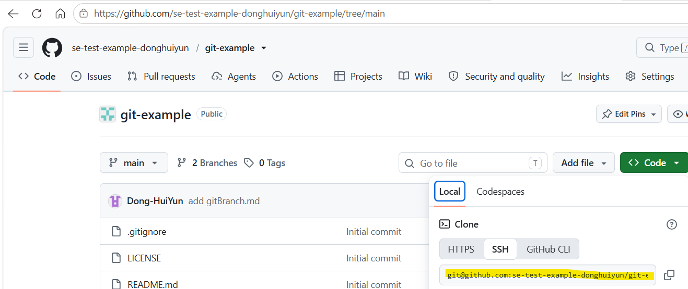
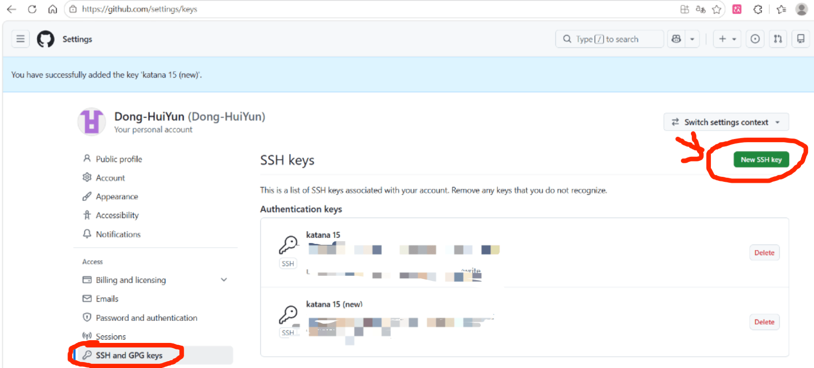
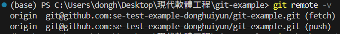
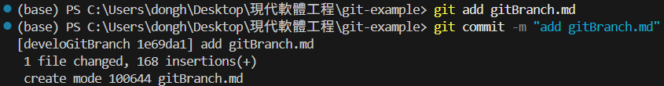
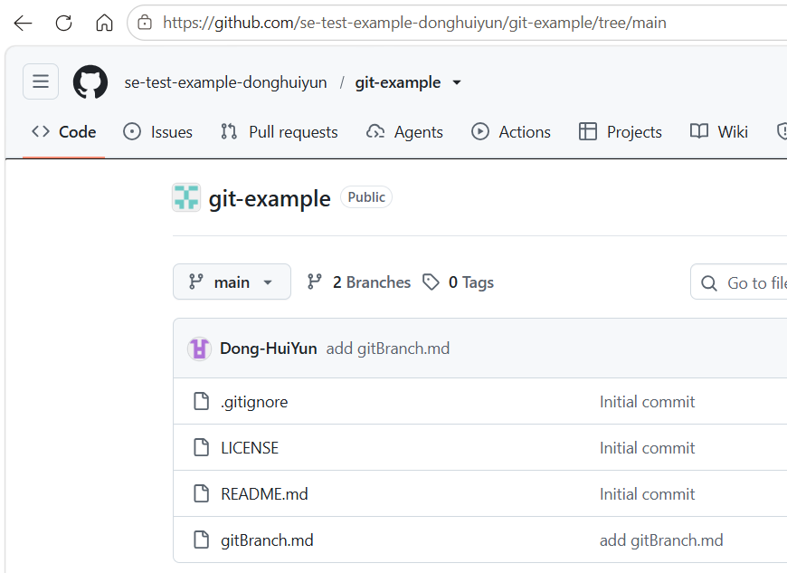
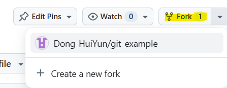
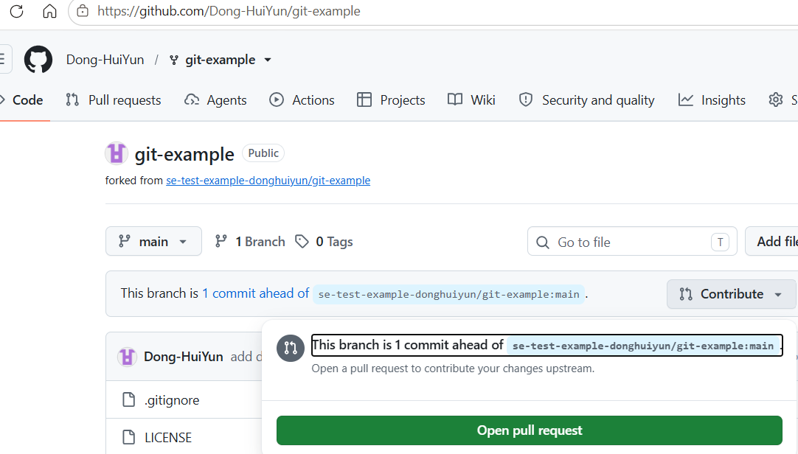
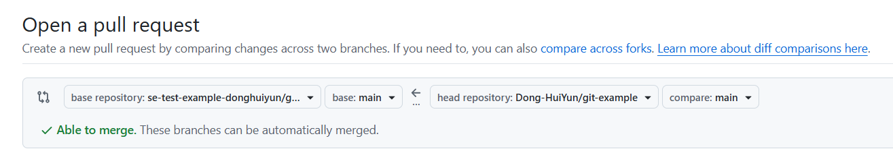

# Git 組織專案與 Fork 子專案協作流程

對組織母專案進行分支開發與合併，以及在個人的 Fork 子專案中提交獨立更新，並說明將子專案變更整合回母專案。

---

## 專案架構

* [組織母專案](https://github.com/se-test-example-donghuiyun/git-example/tree/main)：`https://github.com/se-test-example-donghuiyun/git-example/tree/main`

* [組織母專案分支](https://github.com/se-test-example-donghuiyun/git-example/tree/develoGitBranch)：`https://github.com/se-test-example-donghuiyun/git-example/tree/develoGitBranch`

* [個人 Fork 子專案](https://github.com/Dong-HuiYun/git-example)：`https://github.com/Dong-HuiYun/git-example`

---

## 第一部分：母專案功能分支開發與合併

在此階段中，在母專案中建立分支 `develoGitBranch` 完成開發，並整合回 `main` 主分支。

#### a. 將母專案複製到 VScode 中

複製母專案中的 SSH 內容（複製 SSH 內容本機需要有金鑰）



```powershell

git clone git@github.com:se-test-example-donghuiyun/git-example.git

```

- 使用 SSH 需要金鑰，若沒有金鑰，則參考步驟 b 操作

#### b. 進入本機中的 `powershell`

在 `powershell` 中輸入指令後，自動將金鑰複製到了剪貼板

```powershell

Get-Content ~/.ssh/id_ed25519.pub | Set-Clipboard

```

進入 https://github.com/settings/keys，按下 New SSH key 建立新的金鑰，將剪貼板的金鑰複製過去並儲存。



測試連線：ssh -T git@github.com
連線成功即可進行後續操作


### 1. 在 VScode 的母專案中確認遠端端點

```powershell

git remote -v

```



- fetch (拿取)：遠端 (GitHub) → 本地電腦
- push (推送)：本地電腦 → 遠端 (GitHub)

確認目前本地端指向的 Remote 為組織母專案 `se-test-example-donghuiyun/git-example.git`。

### 2. 建立並切換至新功能分支

```powershell

git checkout -b develoGitBranch
git branch

```

從當前的 `main` 切出一條名為 `develoGitBranch` 的獨立開發分支，避免未驗證的改動直接污染主分支。

### 3. 新增變更並提交 Commit

加入新檔（如：`gitBranch.md`）

```powershell

git add gitBranch.md
git commit -m "add gitBranch.md"

```



將撰寫完成的 `gitBranch.md` 文件加入暫存區，並建立本地提交 `1e69da1`。

### 4. 推送分支至遠端倉庫

```powershell

git push origin develoGitBranch

```

將本地的新分支推送到 GitHub 組織母專案上，使其在雲端留存並可供發起 Pull Request。

### 5. 本地分支合併與同步

```powershell

git checkout main
git merge develoGitBranch
git push origin main

```

切回本機的 `main` 分支，將剛才在 `develoGitBranch` 上的成果以 **Fast-forward** 模式合併進主分支，最後將最新的 `main` 推送到 GitHub 母專案，可以發現母專案的正式主線更新了分支中的專案`gitBranch.md`。



---

## 第二部分：Fork 子專案的獨立開發與推送

在此階段中，在另外一個資料夾（`test`）中操作個人的 Fork 副本。

### 1. 克隆個人的 Fork 子專案

#### a. Fork 母專案

在母專案的右上角，點選 Fork 新增專案



專案克隆到 VScode 以後，不能與母專案在同一個資料夾中，不然會導致原本的資料夾被覆蓋掉

```powershell

cd C:\Users\dongh\Desktop\現代軟體工程\test
git clone git@github.com:Dong-HuiYun/git-example.git
cd git-example

```

將個人帳號下的子專案下載到獨立目錄，此時該目錄的 `origin` 指向的是個人專案 `Dong-HuiYun/git-example`。

### 2. 在子專案進行修改與提交

建立 `donghuiyunFork.md` 檔案，並寫上隨意內容

```powershell

git add .
git commit -m "add donghuiyunFork.md"
git push

```

在子專案中新增 `donghuiyunFork.md` 檔案，提交 Commit `586b1ac`，並推送到個人的 GitHub 子專案 `main` 分支。

---

## 第三部分：將子專案的變更同步進母專案？

在子專案執行的 `git push` **只會更新到個人的 GitHub 倉庫（Dong-HuiYun/git-example），並不會自動同步到組織的母專案中**。

若要讓子專案的新功能正式被母專案採用：

### 透過 GitHub 網頁發起 Pull Request（PR，團隊協作標準做法）

1. 開啟個人子專案網頁：`https://github.com/Dong-HuiYun/git-example`。
2. 頂部會顯示提示「This branch is 1 commit ahead of ...」，點選旁邊的 **Contribute** -> **Open pull request**。

     

3. 檢查設定：

* **base repository**：`se-test-example-donghuiyun/git-example` (base: `main`)

* **head repository**：`Dong-HuiYun/git-example` (compare: `main`)

    


4. 下滑點選 **Create pull request** 送出審查請求。
5. 在母專案中審核無誤後，點選 **Merge pull request**，子專案的改動就會正式合入母專案。